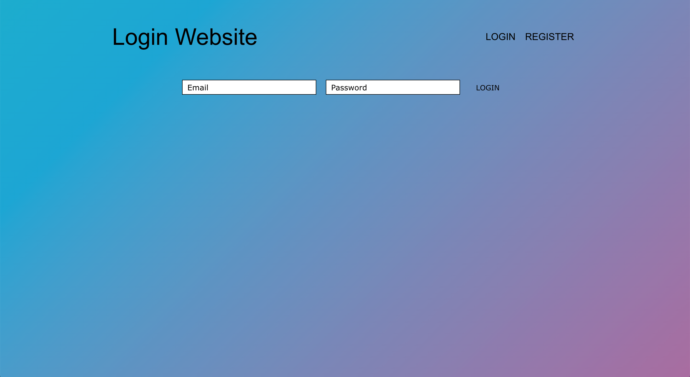
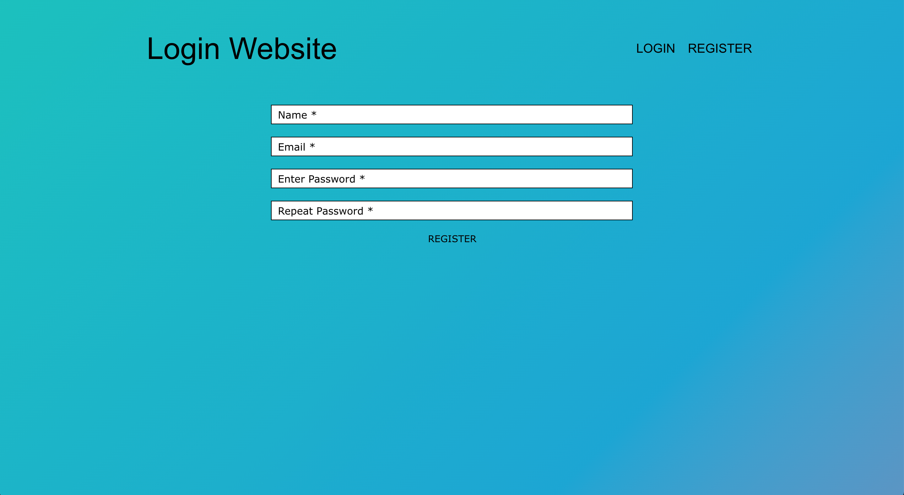

<div id="top"></div>

<br />
<div align="center">

  <h3 align="center">REGISTER & LOGIN WEBSITE</h3>

  <p align="center">
     A project created to show parts of my knowledge with React, Express & MongoDB.
    <br />
    <!-- <a href="https://github.com/toveadam/css-website.md"><strong>Explore the docs »</strong></a> -->
    <br />
    <br />
    <a href="https://login-website-ta.herokuapp.com/">View website</a>
    ·
  </p>
</div>

## About The Project

  
 


  Thank you for visiting! 
  My login website, options for the user to login or register. If login is successful, the user recieves a token and get redirected to a secret page.

## Getting Started

_To use to project, follow the two simple steps below._

2. Clone the repo
   ```sh
   git clone https://github.com/toveadamsson/login-website.git
   ```
3. Install NPM packages
   ```sh
   npm install
   ```

## Contact

Tove Adamsson - toveadamsson@gmail.com

Project Link: [https://github.com/toveadamsson/login-website](https://github.com/toveadamsson/login-website)

<p align="right">(<a href="#top">back to top</a>)</p>